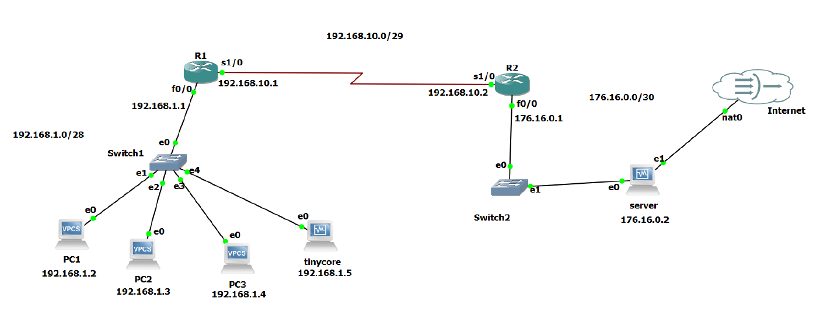
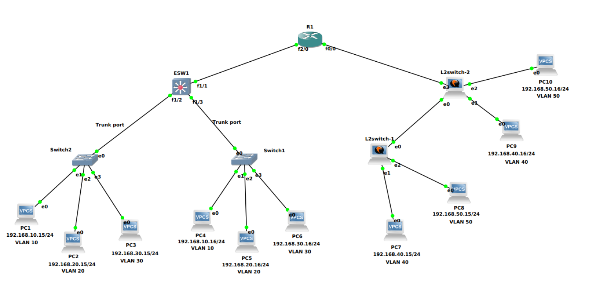

# GNS3 Network Configuration Labs

## Project Overview
This repository contains configuration files and reports from four networking labs conducted in GNS3, focusing on various network configuration techniques. These labs provide hands-on experience in network design, routing protocols, and network address translation (NAT), covering both static and dynamic routing as well as VLAN implementation. The key areas explored include:

1. **Static Routing** – Manual route configuration between routers
2. **Dynamic Routing** – Automated route learning using RIP v2, OSPF, and BGP
3. **NAT (Network Address Translation)** – IP address translation for external connectivity
4. **VLAN (Virtual Local Area Network)** – Network segmentation using VLANs

Each lab includes detailed configurations, testing procedures, and verification steps, ensuring practical understanding of networking principles.

## Repository Contents
The repository includes configurations for the four networking labs:

1. **Static Routing** – Implementation of manually defined routes between routers.
2. **Dynamic Routing** – Configuration of RIP v2, OSPF, and BGP to enable automatic routing.
3. **NAT** – Applying NAT techniques to allow communication between private and public networks.
4. **VLAN** – Setting up VLANs to segment network traffic efficiently.

## Detailed Lab Descriptions

### 1. Static Routing
Static routing is the fundamental approach to network routing, where routes are manually configured on each router rather than dynamically learned. This method is commonly used in smaller networks or where precise control over traffic flow is required.
- **Description:** This lab focuses on designing a network using static routing. The network was divided into smaller subnets to optimize communication and ensure efficient resource utilization
- **Topology:** The network includes multiple routers, each connected via serial or FastEthernet interfaces, with hosts assigned to different subnets
- **Key Features:**
  - Manual route configuration using ip route commands
  - Subnetting of 192.168.1.0/24 and 192.168.2.0/24 to allow efficient IP address allocation
  - Integration of additional routers (R3 and R4) to manage subnet connectivity
  - Use of switches to connect virtual hosts and TinyCore VMs
  - End-to-end connectivity validation using ping and show ip route
  

### 2. Dynamic Routing
Dynamic routing is a scalable approach that allows routers to automatically learn and share routes through routing protocols. This lab involves configuring a multi-router network using RIP v2, OSPF, and BGP, along with NAT implementation.
- **Objective:** Establish full connectivity between Virtual PCs (VPCs) and multiple Internet Service Providers (ISPs) by implementing dynamic routing protocols and NAT
- **Protocols Used:**
  - **RIP v2** – Configured on routers in the left section of the topology, exchanging routing information using multicast (224.0.0.9)
  - **OSPF** – Configured on routers in the right section, ensuring optimized path selection using Dijkstra’s algorithm
  - **BGP** – Used to interconnect different Autonomous Systems (AS) by redistributing RIP and OSPF routes between ISPs
- **Key Features:**
  - Configuring RIP v2 with network statements and enabling version 2
  - Implementing OSPF with appropriate area assignments using router ospf commands
  - Setting up BGP peer relationships and redistributing RIP and OSPF routes
  - Deploying NAT to enable private-to-public IP translation
- **Verification:**
  - Analyzing routing tables with show ip route and comparing results to Dijkstra’s algorithm calculations
  - Using Wireshark to capture RIP v2 and OSPF packets exchanged between routers
  - Testing connectivity between hosts with ping and traceroute
 
   

### 3. NAT (Network Address Translation)
Network Address Translation (NAT) allows multiple devices in a private network to share a limited number of public IP addresses. This lab focuses on configuring Dynamic NAT with Overload (PAT) on router R1 to facilitate communication between internal hosts and an external TinyCore server.
- **Objective:** Configure Dynamic NAT Overload (PAT) to enable multiple internal hosts, including a TinyCore VM, to access external networks and communicate with a TinyCore server (176.16.0.2).
- **Topology:**
  - Internal network with four hosts (192.168.1.0/28), including a TinyCore VM
  - Router R1 performing NAT Overload, allowing private IPs to share a pool of public IPs (192.168.10.3 - 192.168.10.6)
  - Router R2 forwarding traffic between R1 and the external TinyCore server
  - The TinyCore server hosting a webpage and an SSH service for external access
- **Key Features:**
  - Implementation of Dynamic NAT Overload (PAT) to support multiple internal hosts
  - Configuration of network connectivity between private hosts and an external server
  - Ensuring that the TinyCore server is accessible via both SSH and HTTP
  - Verification of successful NAT translation and external access through various connectivity tests
 
    

### 4. VLAN (Virtual Local Area Network)
VLANs are used to segment networks logically, improving security, efficiency, and traffic management. This lab focuses on VLAN creation, VLAN tagging, and inter-VLAN communication using both Layer 2 and Layer 3 devices.
- **Objective:** Implement VLAN segmentation and enable communication between VLANs using an L3 switch and a router.
- **Topology:**
  - **Left section:** VLANs configured on an L3 switch (ESW1), acting as the primary segmentation device
  - **Right section:** VLANs created on L2 switches, relying on a router for inter-VLAN communication
  - Trunking established between switches and routers to facilitate VLAN tagging
- **Key Features:**
  - VLAN creation and assignment to interfaces on both L2 and L3 switches
  - Trunk ports configured for VLAN tagging, ensuring correct traffic forwarding
  - Router-on-a-stick setup on R2, using subinterfaces for each VLAN to enable inter-VLAN routing
  - Validation of VLAN assignments and trunk links using show vlan brief and show interfaces trunk
  - Ping tests conducted between hosts in different VLANs to confirm successful inter-VLAN communication
 
    
